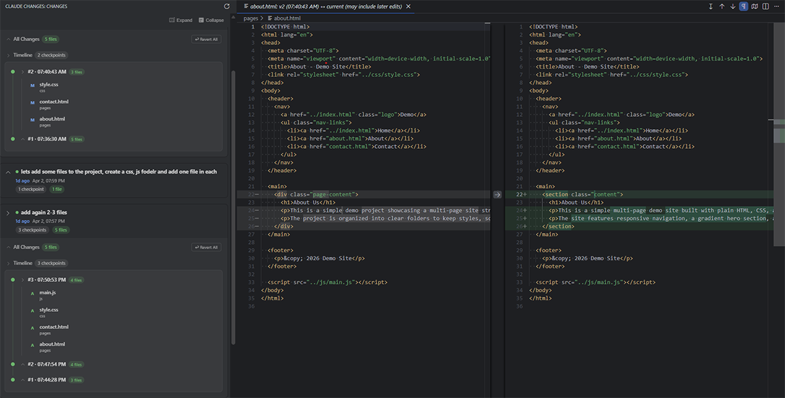

# Claude Changes

Review all file changes made by Claude Code sessions with diffs and one-click revert.

## Features

- **Session overview** — See all Claude Code sessions for your workspace, sorted by most recent
- **All Changes** — See every file Claude changed in a session with cumulative diffs (before vs current)
- **Timeline** — Step-by-step checkpoint diffs showing what Claude changed at each point
- **Diffs** — Click any file to view the diff. A/M/D icons show added, modified, or deleted files
- **Revert** — Restore individual files, delete created files, or "Revert All" to undo an entire session
- **Auto-refresh** — Panel updates automatically as Claude creates new checkpoints
- **Cross-platform** — Works on Linux, macOS, and Windows

## How It Works

Claude Code automatically creates file backups (checkpoints) before editing files. This extension reads that checkpoint data and presents it in a visual panel so you can review what Claude changed and revert if needed.

## Usage

1. Open a project where you've used Claude Code
2. Click the eye icon in the activity bar
3. Expand a session to see all changed files
4. Click a file to view the diff
5. Use the restore/delete buttons or "Revert All" to undo changes

## Requirements

- [Claude Code](https://docs.anthropic.com/en/docs/claude-code) must be installed and used at least once in your project

## Disclaimer

This is an independent community extension and is **not affiliated with, endorsed by, or associated with Anthropic** or the official Claude Code project. It simply reads the checkpoint data that Claude Code creates locally on your machine.
